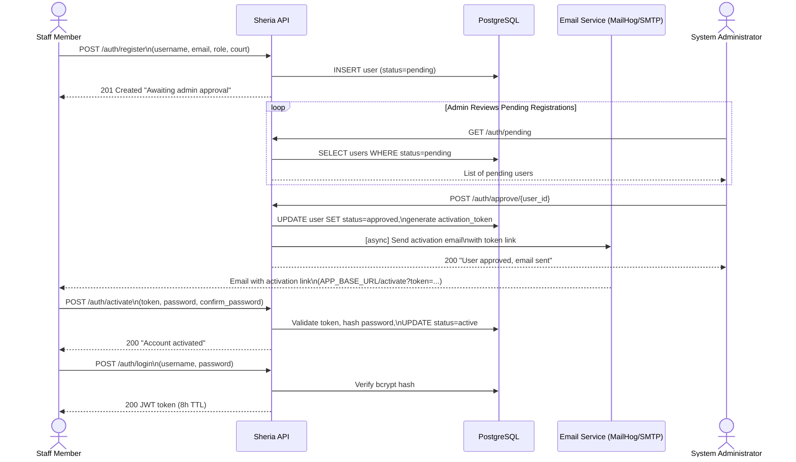
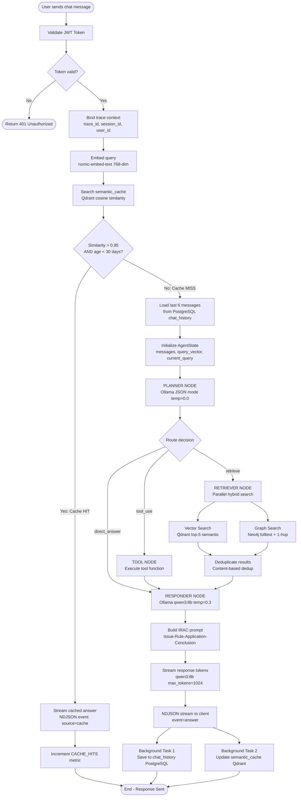
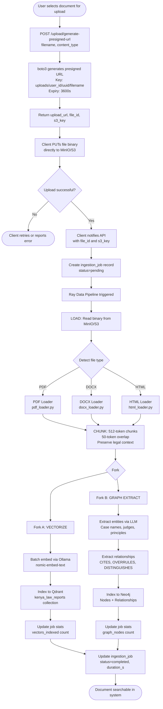
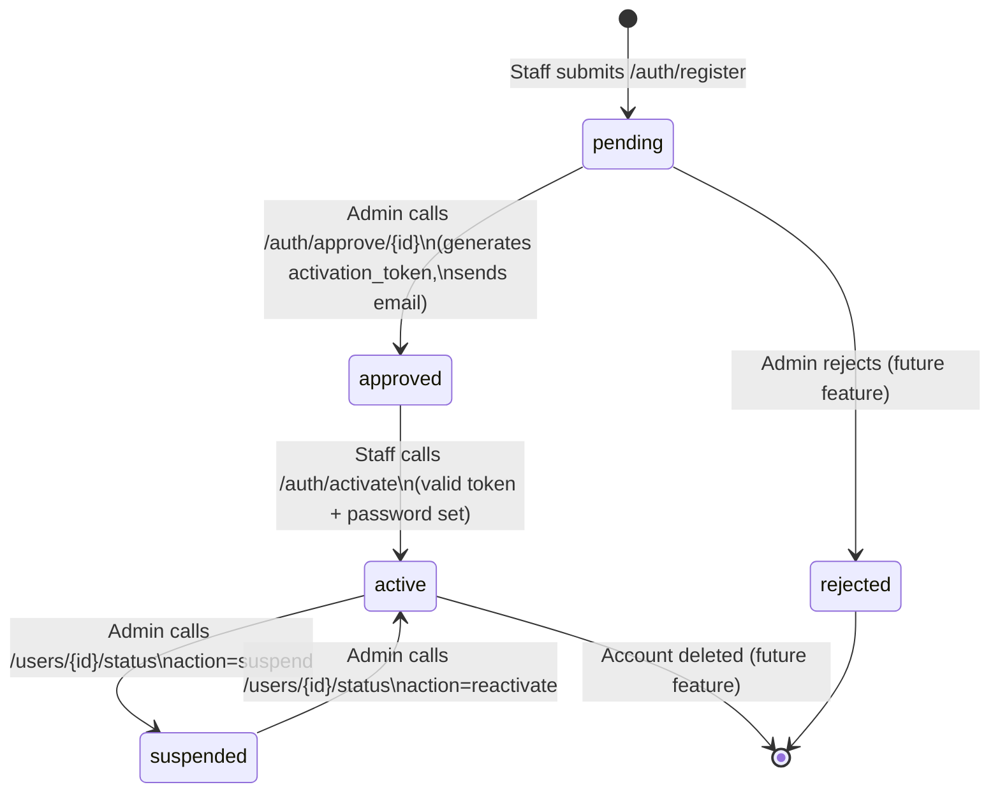
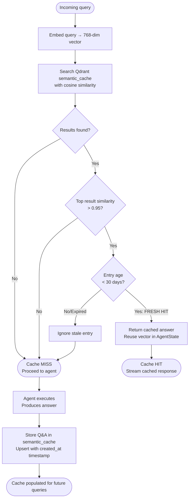
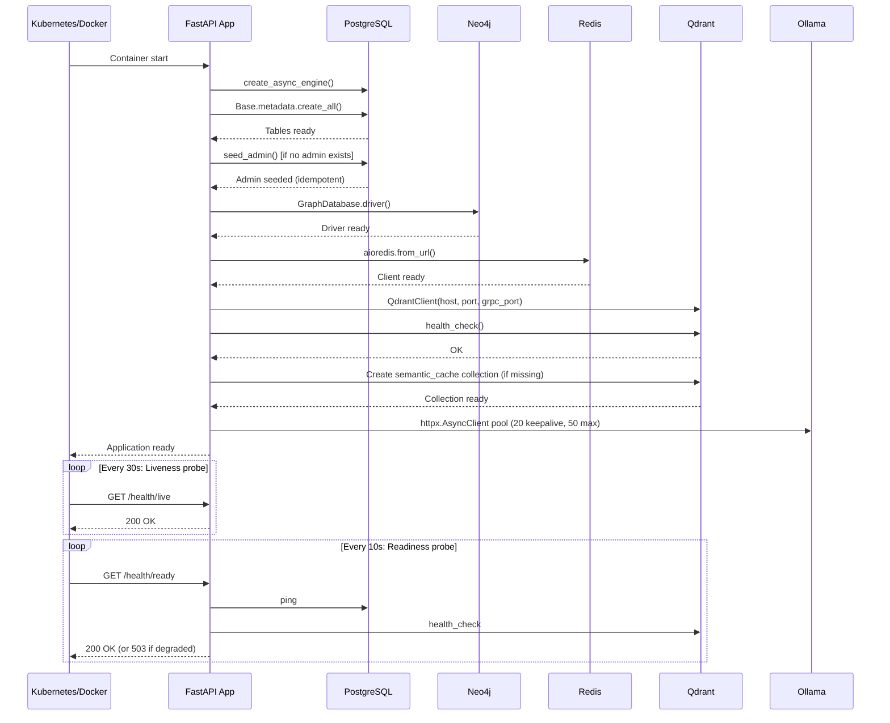
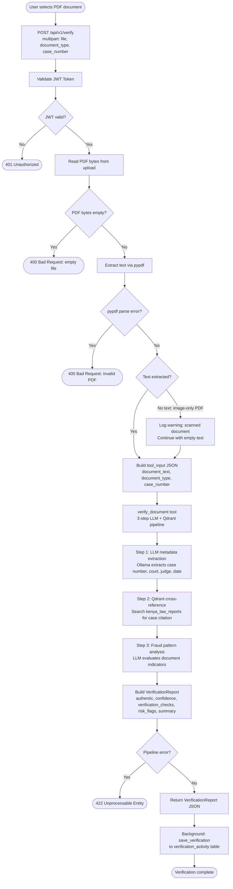

# Sheria Platform — Business Process Workflows (BPMN)

This document captures the core business processes as BPMN 2.0 descriptions and Mermaid flow diagrams.

---

## Process 1: User Registration & Activation

**Participants:** Staff Member, System, Admin

### Mermaid Diagram



### BPMN 2.0 XML

```xml
<?xml version="1.0" encoding="UTF-8"?>
<definitions xmlns="http://www.omg.org/spec/BPMN/20100524/MODEL"
             xmlns:xsi="http://www.w3.org/2001/XMLSchema-instance"
             targetNamespace="http://sheria.judiciary.go.ke/bpmn"
             id="UserRegistrationProcess">

  <collaboration id="Collab_Registration">
    <participant id="Pool_Staff" name="Staff Member" processRef="Proc_Staff"/>
    <participant id="Pool_System" name="Sheria System" processRef="Proc_System"/>
    <participant id="Pool_Admin" name="Administrator" processRef="Proc_Admin"/>
  </collaboration>

  <process id="Proc_System" name="User Registration &amp; Activation" isExecutable="true">

    <!-- Start Event -->
    <startEvent id="Start_Receive_Registration" name="Receive Registration Request">
      <messageEventDefinition messageRef="Msg_Registration"/>
    </startEvent>

    <!-- Task: Validate Input -->
    <serviceTask id="Task_Validate_Input" name="Validate Registration Data">
      <documentation>Validate username uniqueness, email format, role validity</documentation>
    </serviceTask>

    <!-- Gateway: Duplicate Check -->
    <exclusiveGateway id="GW_Duplicate" name="User Already Exists?"/>

    <!-- Task: Reject Duplicate -->
    <serviceTask id="Task_Reject_Duplicate" name="Return 409 Conflict"/>

    <!-- Task: Create Pending User -->
    <serviceTask id="Task_Create_User" name="Create User (status=pending)">
      <documentation>INSERT INTO users with status=pending</documentation>
    </serviceTask>

    <!-- Task: Notify Admin -->
    <serviceTask id="Task_Notify_Admin" name="Return 201 to Staff"/>

    <!-- Intermediate: Wait for Admin Approval -->
    <intermediateCatchEvent id="Wait_Admin_Approval" name="Wait for Admin Approval">
      <messageEventDefinition messageRef="Msg_AdminApproval"/>
    </intermediateCatchEvent>

    <!-- Task: Generate Activation Token -->
    <serviceTask id="Task_Gen_Token" name="Generate Activation Token and Update Status">
      <documentation>status=approved, generate UUID activation_token</documentation>
    </serviceTask>

    <!-- Task: Send Email (Async) -->
    <serviceTask id="Task_Send_Email" name="Send Activation Email (Async)">
      <documentation>aiosmtplib fire-and-forget email with activation link</documentation>
    </serviceTask>

    <!-- Intermediate: Wait for Activation -->
    <intermediateCatchEvent id="Wait_Activation" name="Wait for Staff to Activate">
      <messageEventDefinition messageRef="Msg_Activation"/>
    </intermediateCatchEvent>

    <!-- Task: Validate Token -->
    <serviceTask id="Task_Validate_Token" name="Validate Activation Token"/>

    <!-- Gateway: Token Valid? -->
    <exclusiveGateway id="GW_Token_Valid" name="Token Valid?"/>

    <!-- Task: Reject Invalid Token -->
    <serviceTask id="Task_Reject_Token" name="Return 400 Invalid Token"/>

    <!-- Task: Activate Account -->
    <serviceTask id="Task_Activate" name="Hash Password, Set status=active">
      <documentation>bcrypt hash password, UPDATE users SET status=active, activated_at=now()</documentation>
    </serviceTask>

    <!-- End Events -->
    <endEvent id="End_Success" name="Account Active"/>
    <endEvent id="End_Rejected" name="Registration Rejected"/>
    <endEvent id="End_TokenInvalid" name="Activation Failed"/>

    <!-- Sequence Flows -->
    <sequenceFlow id="sf1" sourceRef="Start_Receive_Registration" targetRef="Task_Validate_Input"/>
    <sequenceFlow id="sf2" sourceRef="Task_Validate_Input" targetRef="GW_Duplicate"/>
    <sequenceFlow id="sf3" sourceRef="GW_Duplicate" targetRef="Task_Reject_Duplicate" name="Yes"/>
    <sequenceFlow id="sf4" sourceRef="GW_Duplicate" targetRef="Task_Create_User" name="No"/>
    <sequenceFlow id="sf5" sourceRef="Task_Reject_Duplicate" targetRef="End_Rejected"/>
    <sequenceFlow id="sf6" sourceRef="Task_Create_User" targetRef="Task_Notify_Admin"/>
    <sequenceFlow id="sf7" sourceRef="Task_Notify_Admin" targetRef="Wait_Admin_Approval"/>
    <sequenceFlow id="sf8" sourceRef="Wait_Admin_Approval" targetRef="Task_Gen_Token"/>
    <sequenceFlow id="sf9" sourceRef="Task_Gen_Token" targetRef="Task_Send_Email"/>
    <sequenceFlow id="sf10" sourceRef="Task_Send_Email" targetRef="Wait_Activation"/>
    <sequenceFlow id="sf11" sourceRef="Wait_Activation" targetRef="Task_Validate_Token"/>
    <sequenceFlow id="sf12" sourceRef="Task_Validate_Token" targetRef="GW_Token_Valid"/>
    <sequenceFlow id="sf13" sourceRef="GW_Token_Valid" targetRef="Task_Reject_Token" name="Invalid"/>
    <sequenceFlow id="sf14" sourceRef="GW_Token_Valid" targetRef="Task_Activate" name="Valid"/>
    <sequenceFlow id="sf15" sourceRef="Task_Reject_Token" targetRef="End_TokenInvalid"/>
    <sequenceFlow id="sf16" sourceRef="Task_Activate" targetRef="End_Success"/>
  </process>

</definitions>
```

---

## Process 2: Legal Research Chat (Agentic RAG)

**Participants:** Judge/Staff, System (API + Agent + Databases)

### Mermaid Flow Diagram



### BPMN 2.0 XML

```xml
<?xml version="1.0" encoding="UTF-8"?>
<definitions xmlns="http://www.omg.org/spec/BPMN/20100524/MODEL"
             targetNamespace="http://sheria.judiciary.go.ke/bpmn"
             id="LegalResearchChatProcess">

  <process id="Proc_Chat" name="Legal Research Chat" isExecutable="true">

    <startEvent id="Start" name="User Sends Message"/>

    <serviceTask id="Task_ValidateJWT" name="Validate JWT Token"/>
    <exclusiveGateway id="GW_Auth" name="Authenticated?"/>
    <serviceTask id="Task_Return401" name="Return 401 Unauthorized"/>
    <endEvent id="End_Unauthorized"/>

    <serviceTask id="Task_BindContext" name="Bind Trace Context\n(trace_id, session_id, user_id)"/>
    <serviceTask id="Task_EmbedQuery" name="Embed Query\n(nomic-embed-text, 768-dim)"/>
    <serviceTask id="Task_CheckCache" name="Search Semantic Cache\n(Qdrant cosine similarity)"/>

    <exclusiveGateway id="GW_Cache" name="Cache Hit?"/>

    <!-- Cache Hit Path -->
    <serviceTask id="Task_StreamCache" name="Stream Cached Answer\n(source=cache)"/>
    <endEvent id="End_CacheHit" name="Response from Cache"/>

    <!-- Cache Miss Path -->
    <serviceTask id="Task_LoadHistory" name="Load Conversation History\n(Last 6 messages, PostgreSQL)"/>
    <serviceTask id="Task_InitState" name="Initialize AgentState"/>

    <!-- Planner Node -->
    <serviceTask id="Task_Planner" name="PLANNER NODE\nOllama JSON mode (temp=0.0)\nOutputs: action, refined_query"/>
    <exclusiveGateway id="GW_Route" name="Agent Route Decision"/>

    <!-- Retriever Path -->
    <serviceTask id="Task_Retriever" name="RETRIEVER NODE\nParallel: Vector + Graph Search"/>
    <parallelGateway id="PG_Split" name="Parallel Search"/>
    <serviceTask id="Task_VectorSearch" name="Qdrant Vector Search\n(top-5 semantic results)"/>
    <serviceTask id="Task_GraphSearch" name="Neo4j Graph Search\n(fulltext + 1-hop neighbors)"/>
    <parallelGateway id="PG_Join" name="Merge Results"/>
    <serviceTask id="Task_Deduplicate" name="Deduplicate Results\n(content-based)"/>

    <!-- Tool Path -->
    <serviceTask id="Task_Tool" name="TOOL NODE\nExecute tool function"/>

    <!-- Responder Node -->
    <serviceTask id="Task_Responder" name="RESPONDER NODE\nBuild IRAC prompt\nOllama qwen3:8b (temp=0.3)"/>
    <serviceTask id="Task_StreamAnswer" name="Stream Answer to Client\n(NDJSON events)"/>

    <!-- Background Tasks -->
    <parallelGateway id="PG_BG_Split"/>
    <serviceTask id="Task_SaveHistory" name="Save to chat_history\n(PostgreSQL)"/>
    <serviceTask id="Task_UpdateCache" name="Update Semantic Cache\n(Qdrant upsert)"/>
    <parallelGateway id="PG_BG_Join"/>

    <endEvent id="End_AgentResponse" name="Response Sent"/>

    <!-- Sequence Flows: Main Path -->
    <sequenceFlow sourceRef="Start" targetRef="Task_ValidateJWT"/>
    <sequenceFlow sourceRef="Task_ValidateJWT" targetRef="GW_Auth"/>
    <sequenceFlow sourceRef="GW_Auth" targetRef="Task_Return401" name="Invalid"/>
    <sequenceFlow sourceRef="GW_Auth" targetRef="Task_BindContext" name="Valid"/>
    <sequenceFlow sourceRef="Task_Return401" targetRef="End_Unauthorized"/>
    <sequenceFlow sourceRef="Task_BindContext" targetRef="Task_EmbedQuery"/>
    <sequenceFlow sourceRef="Task_EmbedQuery" targetRef="Task_CheckCache"/>
    <sequenceFlow sourceRef="Task_CheckCache" targetRef="GW_Cache"/>

    <!-- Cache paths -->
    <sequenceFlow sourceRef="GW_Cache" targetRef="Task_StreamCache" name="HIT"/>
    <sequenceFlow sourceRef="Task_StreamCache" targetRef="End_CacheHit"/>
    <sequenceFlow sourceRef="GW_Cache" targetRef="Task_LoadHistory" name="MISS"/>

    <!-- Agent path -->
    <sequenceFlow sourceRef="Task_LoadHistory" targetRef="Task_InitState"/>
    <sequenceFlow sourceRef="Task_InitState" targetRef="Task_Planner"/>
    <sequenceFlow sourceRef="Task_Planner" targetRef="GW_Route"/>
    <sequenceFlow sourceRef="GW_Route" targetRef="Task_Retriever" name="retrieve"/>
    <sequenceFlow sourceRef="GW_Route" targetRef="Task_Responder" name="direct_answer"/>
    <sequenceFlow sourceRef="GW_Route" targetRef="Task_Tool" name="tool_use"/>
    <sequenceFlow sourceRef="Task_Tool" targetRef="Task_Responder"/>

    <!-- Retriever parallel -->
    <sequenceFlow sourceRef="Task_Retriever" targetRef="PG_Split"/>
    <sequenceFlow sourceRef="PG_Split" targetRef="Task_VectorSearch"/>
    <sequenceFlow sourceRef="PG_Split" targetRef="Task_GraphSearch"/>
    <sequenceFlow sourceRef="Task_VectorSearch" targetRef="PG_Join"/>
    <sequenceFlow sourceRef="Task_GraphSearch" targetRef="PG_Join"/>
    <sequenceFlow sourceRef="PG_Join" targetRef="Task_Deduplicate"/>
    <sequenceFlow sourceRef="Task_Deduplicate" targetRef="Task_Responder"/>

    <!-- Responder to stream -->
    <sequenceFlow sourceRef="Task_Responder" targetRef="Task_StreamAnswer"/>
    <sequenceFlow sourceRef="Task_StreamAnswer" targetRef="PG_BG_Split"/>
    <sequenceFlow sourceRef="PG_BG_Split" targetRef="Task_SaveHistory"/>
    <sequenceFlow sourceRef="PG_BG_Split" targetRef="Task_UpdateCache"/>
    <sequenceFlow sourceRef="Task_SaveHistory" targetRef="PG_BG_Join"/>
    <sequenceFlow sourceRef="Task_UpdateCache" targetRef="PG_BG_Join"/>
    <sequenceFlow sourceRef="PG_BG_Join" targetRef="End_AgentResponse"/>
  </process>

</definitions>
```

---

## Process 3: Document Upload and Ingestion

### Mermaid Flow Diagram



---

## Process 4: Admin User Management

### Mermaid State Diagram



---

## Process 5: Semantic Cache Lifecycle

### Mermaid Flow Diagram



---

## Process 6: Health Check & Startup Sequence

### Mermaid Sequence Diagram



---

## Process 7: Document Verification (Sheria Verify)

**Participants:** Court Staff/Registrar, Sheria API, Verification Pipeline

### Mermaid Flow Diagram



### BPMN 2.0 Description

**Process:** `DocumentVerification`
**Participants:** Staff Member (lane), Sheria API (lane), Verification Pipeline (lane)

**Tasks:**
1. `Task_Upload` — Staff POSTs multipart form to `/api/v1/verify`
2. `Task_Auth` — JWT validation via `get_current_user` dependency
3. `Task_ReadPDF` — Read upload bytes into memory
4. `Task_ExtractText` — `pypdf` text extraction (graceful on scanned PDFs)
5. `Task_MetadataExtract` — LLM call: extract structured metadata from document text
6. `Task_CrossReference` — Qdrant search: look up case citation in `kenya_law_reports`
7. `Task_FraudAnalysis` — LLM call: evaluate fraud indicators, assign confidence score
8. `Task_BuildReport` — Assemble `VerificationReport` Pydantic model
9. `Task_PersistActivity` — Background: `save_verification()` → `verification_activity` table

**Gateways:**
- `GW_Auth` — JWT valid? → continue | 401
- `GW_EmptyFile` — bytes > 0? → continue | 400
- `GW_ParseError` — pypdf success? → continue | 400
- `GW_PipelineError` — tool raised exception? → 422 | continue

**End events:**
- `End_Verified` — Report returned to client
- `End_Unauthorized` — 401
- `End_InvalidFile` — 400
- `End_PipelineError` — 422
